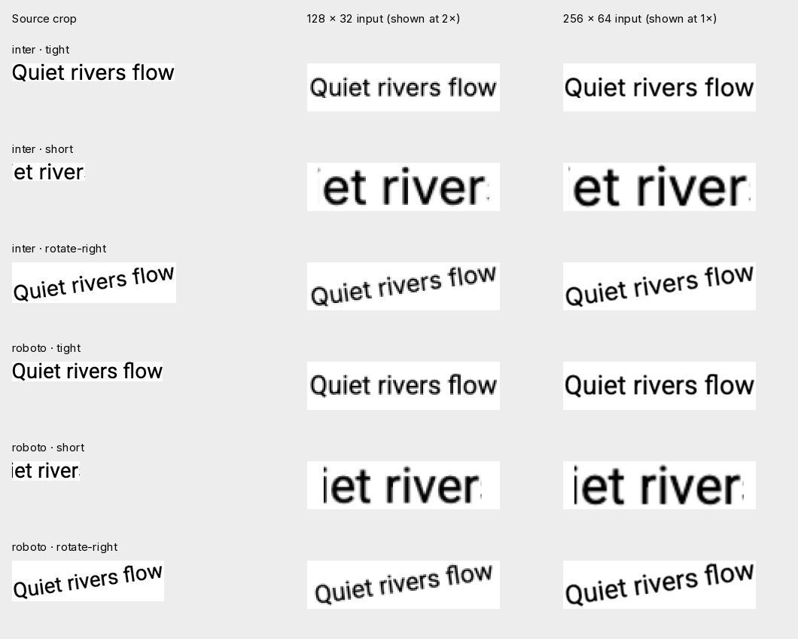

# One-font verification — 2026-09-21

The training target is **Inter versus other fonts**, not character recognition. A single positive class without negatives could be solved by always answering Inter. This experiment trains one shared CNN with a two-output classification head and cross-entropy loss. It does not use the descriptor.

Run `npm run train:robustness` after the pilot font/renderer setup. Configuration: [robustness.json](robustness.json). Code: [trainer and generator](../train/robustness.py), [shared preprocessing runner](../scripts/robustness.mjs). Models and datasets stay in `.data/robustness/`.

## Experiment

- Target: Inter regular. Training negatives: the other 13 pilot training families, including Roboto, Open Sans, Poppins and Source Sans 3. Six additional families remain unseen negatives until development evaluation.
- 3,584 training images: 256 per family, from 24 text strings. Batches contain 24 Inter examples and 24 negative examples with matching text and transformation plans. The source words, crop positions, colors and transforms therefore cannot serve as class labels.
- 896 calibration images: eight separate strings, 64 images per family. The threshold is selected here for at most 5% false positives. Ties at the threshold are excluded; the threshold is representable in float32.
- 5,760 development images: 320 existing Pillow and 320 existing Chromium crops, each transformed nine ways. These use two other strings, sizes 14/28 and DPR 1/2, with both polarities. Conditions: clean, tight, short, small, rotation −8°/+8°, blur, JPEG, and a combined distortion. Browser images receive the subsequent transforms in Pillow.
- Training randomizes horizontal window width/position, uniform scale, padding, small rotation, blur, JPEG compression, and polarity. It does not synthesize italics, change font axes, stretch proportions, or introduce textured backgrounds.
- Both runs use the same 25,120-parameter encoder, a 66-parameter classification head, 1,200 Adam steps, seed 2718, learning rate 0.001 and four CPU threads. The ablation changes only input geometry from 128 × 32 to 256 × 64, retaining two pixels of padding. Export/reload logits match exactly.

The comparison-sheet reader verifies source and tensor checksums, exact lengths, matching sample/configuration manifests, and each training report's manifest hash before drawing. Its regression tests use a one-pixel source and known grayscale tensors to check exact plotted pixels through A → A → B → A, and reject stale, truncated, trailing, and non-finite data. The test fixture uses Pillow's bundled font; no downloaded font data is required for the unit tests.

## Results

Recall is the fraction of Inter crops accepted. False-positive rate is the fraction of other-font crops incorrectly accepted as Inter. These are binary verification metrics, not top-5 retrieval scores.

| Input | Training recall / FPR | Calibration recall / FPR | Pillow development recall / FPR | Chromium development recall / FPR |
| --- | --- | --- | --- | --- |
| 128 × 32 | 90.6% / 2.2% | 26.6% / 4.9% | 2.8% / 1.0% | 1.4% / 1.1% |
| 256 × 64 | 83.2% / 3.7% | 26.6% / 4.9% | 25.0% / 3.1% | 43.1% / 9.8% |

Full counts and condition/family breakdowns: [128 × 32](robustness-pilot.json), [256 × 64](robustness-detail.json). Neither run meets a useful acceptance target. Greater recall at 256 × 64 also brings more false positives; this is not an accuracy win at a matched evaluation FPR. Thresholds were not retuned on development queries.

At 256 × 64, the browser tight-crop condition accepts 11/16 Inter examples, but short windows and −8° rotation accept 0/16 each. Poppins and Roboto supply the most false positives across both development renderers. The strong training/development gap also exists within Pillow, so renderer transfer alone does not explain the failure.

This is one seed and a small, previously inspected development corpus. The 5,760 transformed images share only two query strings; they are not 5,760 independent screenshots. There are no real-photo, background-texture, italic, variable-weight, or unknown-font claims. The experimental binary models are separate from the demo's original 20-family retrieval model; they have not passed browser inference parity or a deployment gate.

## Training sequence

1. **First learn font identity across new text.** Increase the training text pool from 24 strings to hundreds of distinct words and varied character sequences. Split underlying text before generating any views. Expand calibration and evaluation beyond eight/two strings and add verified screenshots. Keep Inter as the target and explicit confusable negatives.
2. **Keep enough letter detail.** Compare fixed-height word/windows against fitting an entire line; inspect the exact tensors. Keep geometry uniform. Increasing resolution helped this experiment, but the useful input policy is not settled.
3. **Use a curriculum with separate measurements.** Establish clean upright recognition first; add short/tight crops and scale next, then rotation, blur/JPEG and backgrounds. Retain earlier conditions in training and evaluation. Do not combine more modifiers until their individual effects are measured.
4. **Require a one-font gate before expansion.** Proposed development target: ≥90% Inter recall with ≤5% false positives, using a threshold fixed on separate calibration data, with counts and results for each supported condition. This is not achieved. Then train Inter / Roboto / other, then 5 and 20 families together. Do not create a separate network for each font or discard earlier families when adding new ones.
5. **Separate font properties from image corruption.** Actual weight, width and slant need recorded font-axis/style labels and later prediction heads. Screenshot rotation and compression are nuisance changes. Arbitrary stretching or synthetic bolding can erase distinctions we want the model to retain.
6. **Only then optimize delivery.** Evaluate a larger reference encoder if data/input corrections still fail, then distill/quantize a successful model into the browser budget. Preserve CPU/PyTorch/WebGPU parity checks for any promoted artifact. Automatic text-region detection remains separate from identifying a supplied crop.

The conventional starting point is synthetic labeled font images plus CNN classification, as explored in [DeepFont](https://arxiv.org/abs/1507.03196). As the catalog grows, [supervised contrastive learning](https://research.google/blog/extending-contrastive-learning-to-the-supervised-setting/) provides the objective for pulling different words/views of the same family together while separating other families. Neither method requires OCR as a prerequisite for a supplied text crop. These references motivate the experiments; their reported performance is not ours.
